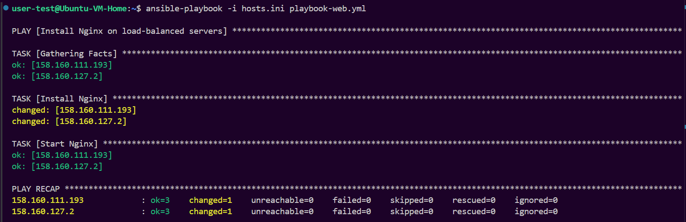
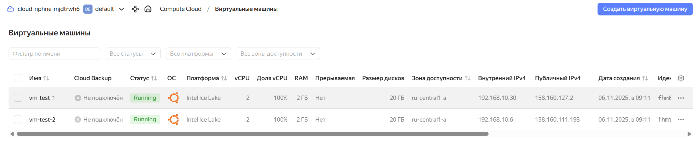
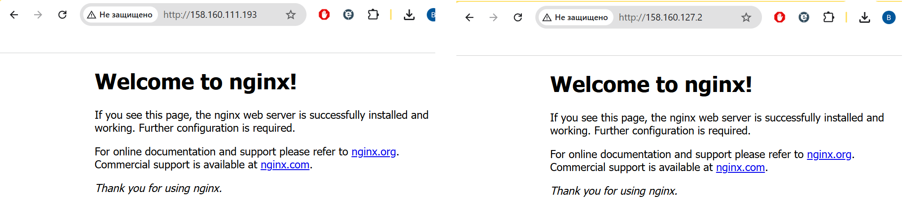
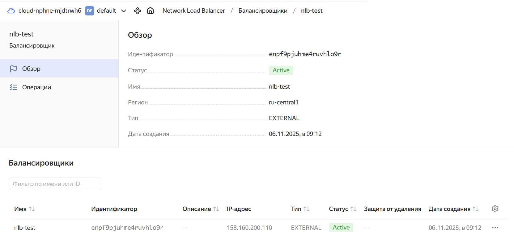
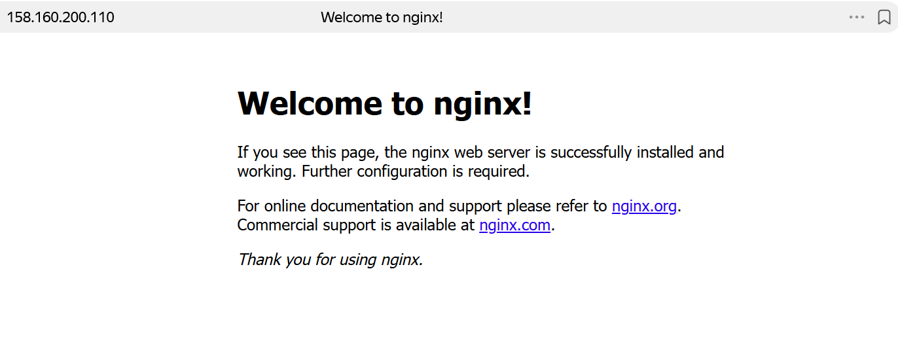

# Домашнее задание к занятию "`Домашняя работа 10-4`" - `Маховского Виктора`

---

### Задание 1

`Возьмите за основу решение к заданию 1 из занятия «Подъём инфраструктуры в Яндекс Облаке».`

1. `Теперь вместо одной виртуальной машины сделайте terraform playbook, который:`
* `создаст 2 идентичные виртуальные машины. Используйте аргумент count для создания таких ресурсов;`
* `создаст таргет-группу. Поместите в неё созданные на шаге 1 виртуальные машины;`
* `создаст сетевой балансировщик нагрузки, который слушает на порту 80, отправляет трафик на порт 80 виртуальных машин и http healthcheck на порт 80 виртуальных машин.`

`Рекомендуем изучить документацию сетевого балансировщика нагрузки для того, чтобы было понятно, что вы сделали.`

2. `Установите на созданные виртуальные машины пакет Nginx любым удобным способом и запустите Nginx веб-сервер на порту 80.`

3. `Перейдите в веб-консоль Yandex Cloud и убедитесь, что:`
* `созданный балансировщик находится в статусе Active,`
* `обе виртуальные машины в целевой группе находятся в состоянии healthy.`

4. `Сделайте запрос на 80 порт на внешний IP-адрес балансировщика и убедитесь, что вы получаете ответ в виде дефолтной страницы Nginx.`


### Решение

`В качестве результата пришлите:`

1. `Terraform Playbook.`

`providers.tf`
```
# providers.tf
terraform {
  required_providers {
    yandex = {
      source  = "yandex-cloud/yandex"
      version = "~> 0.169"
    }
  }
}

provider "yandex" {
  cloud_id                 = var.cloud_id
  folder_id                = var.folder_id
  service_account_key_file = file("~/authorized_key.json")
  zone                     = "ru-central1-a"
}
```

`terraform.tfvars`
```
cloud_id  = "xxxxxx"
folder_id = "xxxxxx"
```

`cloud-config.yml`
```
#cloud-config
users:
  - name: user
    groups: sudo
    shell: /bin/bash
    sudo: ["ALL=(ALL) NOPASSWD:ALL"]
    ssh_authorized_keys:
      - ssh-ed25519 xxxxx yandex-10-4@user
```

`main.tf`
```
# 1. -> Считываем providers.tf
# 2. -> Считываем terraform.tfvars

# Получаем последний образ Ubuntu 24.04 LTS
data "yandex_compute_image" "ubuntu" {
  folder_id = "standard-images"
  family    = "ubuntu-24-04-lts"
}

# Сеть и подсеть
resource "yandex_vpc_network" "net" {
  name = "net-lb-${var.flow}"
}

resource "yandex_vpc_subnet" "subnet" {
  name           = "subnet-lb-${var.flow}"
  zone           = "ru-central1-a"
  network_id     = yandex_vpc_network.net.id
  v4_cidr_blocks = ["192.168.10.0/24"]
}

# Группа безопасности: разрешаем 22 (SSH), 80 (HTTP)
resource "yandex_vpc_security_group" "sg" {
  name       = "sg-lb-${var.flow}"
  network_id = yandex_vpc_network.net.id

  ingress {
    protocol       = "TCP"
    port           = 22
    v4_cidr_blocks = ["0.0.0.0/0"]
  }
  ingress {
    protocol       = "TCP"
    port           = 80
    v4_cidr_blocks = ["0.0.0.0/0"]
  }
  egress {
    protocol       = "ANY"
    v4_cidr_blocks = ["0.0.0.0/0"]
  }
}

# Создаем виртуальные машины
resource "yandex_compute_instance" "vm" {
  count = 2

  name        = "vm-${var.flow}-${count.index + 1}"
  platform_id = "standard-v3"
  zone        = "ru-central1-a"

  resources {
    cores  = 2
    memory = 2
  }

  boot_disk {
    initialize_params {
      image_id = data.yandex_compute_image.ubuntu.id
      type     = "network-hdd"
      size     = 20
    }
  }

  network_interface {
    subnet_id          = yandex_vpc_subnet.subnet.id
    security_group_ids = [yandex_vpc_security_group.sg.id]
    nat                = true
  }

  metadata = {
    user-data = file("cloud-config.yml")
  }
}

# Таргет-группа с указанием subnet_id в каждом target
resource "yandex_lb_target_group" "tg" {
  name = "tg-${var.flow}"

  target {
    subnet_id = yandex_vpc_subnet.subnet.id
    address   = yandex_compute_instance.vm[0].network_interface[0].ip_address
  }
  target {
    subnet_id = yandex_vpc_subnet.subnet.id
    address   = yandex_compute_instance.vm[1].network_interface[0].ip_address
  }
}

# Сетевой балансировщик
resource "yandex_lb_network_load_balancer" "nlb" {
  name = "nlb-${var.flow}"

  listener {
    name = "http-80"
    port = 80
    external_address_spec {
      ip_version = "ipv4"
    }
    protocol = "tcp"
  }

  attached_target_group {
    target_group_id = yandex_lb_target_group.tg.id

    healthcheck {
      name = "nginx-http"
      http_options {
        port = 80
        path = "/"
      }
      timeout            = "3"
      interval           = "10"
      healthy_threshold  = 2
      unhealthy_threshold = 2
    }
  }
}

# Создаем hosts.ini с публичными IP
resource "local_file" "hosts_ini" {
  content = <<-EOT
[webservers]
${yandex_compute_instance.vm[0].network_interface[0].nat_ip_address}
${yandex_compute_instance.vm[1].network_interface[0].nat_ip_address}
EOT

  filename = "${path.module}/hosts.ini"
}

# Выводим IP балансировщика
output "lb_external_ip" {
  value = one(flatten([
    for listener in yandex_lb_network_load_balancer.nlb.listener :
    [for spec in listener.external_address_spec : spec.address]
  ]))
}
```

`playbook-nginx.yml`
```
- name: Home 10-4 - Install NGINX 
  hosts: webservers
  remote_user: user
  become: yes
  tasks:
    - name: Install Nginx
      apt:
        name: nginx
        update_cache: yes
        state: present
    - name: Start Nginx
      systemd:
        name: nginx
        state: started
        enabled: yes
```



2. `Скриншот статуса балансировщика и целевой группы.`

`Скриншот вирутальных машин в yandex.cloud`


`Работа Nginx на виртуальных машинах`


`Скриншот балансировщика`


3. `Скриншот страницы, которая открылась при запросе IP-адреса балансировщика.`




---


